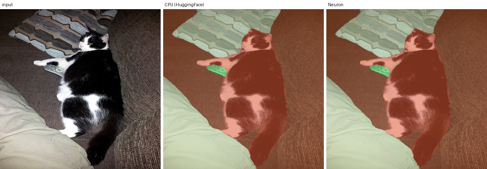
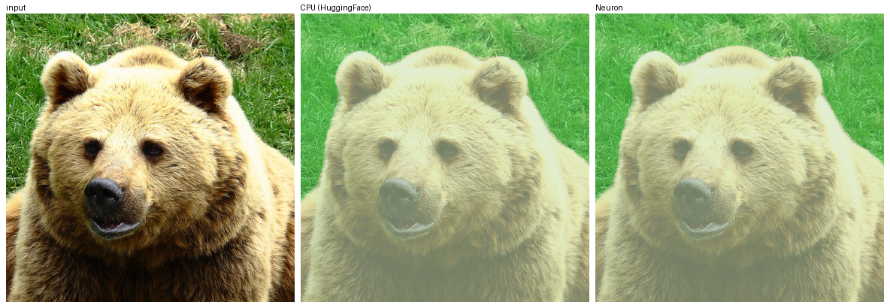
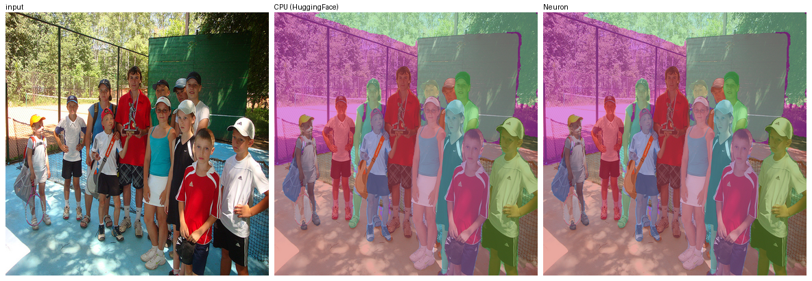

# OneFormer Swin-L on Trainium — bring-up notes

[OneFormer](https://github.com/SHI-Labs/OneFormer) is universal image segmentation:
one model, one set of weights, three tasks (semantic / instance / panoptic) selected by
a task token at inference. This directory brings `shi-labs/oneformer_coco_swin_large`
up on Trainium — developed on Trn2, since re-run unchanged on Trn1.

**Status: working.** The whole model compiles to a single graph and runs on one
NeuronCore, and its panoptic segmentation is **pixel-for-pixel identical** to
HuggingFace on CPU on every image tried — same segments, same order, same scores to
four decimals. A forward is **230 ms on trn1.2xlarge** (244 ms before the tuning below)
and 333 ms on trn2.3xlarge, about 2-3x the same forward on 12 CPU cores. Nine patches
were needed; every one is a compiler constraint, and all of them together leave the model
numerically unchanged on CPU.

That ratio is modest for an accelerator, and the port has now been profiled rather than
guessed about, so the reason is specific: **54% of the forward is DMA and 34% of it is
one op** — the gather inside deformable attention. The tensor engine is idle 83% of the
time. "Where the 240 ms goes" says what that buys and what was taken: `--optlevel 1` and
an exact power-of-two resize are worth 10.5 ms together (241.0 → 230.5) at unchanged
segmentation, and the 83 ms gather is a *hardware generation* boundary, not a missing
kernel — the NKI kernel for it is written and needs Trainium2. bfloat16 is 9% faster and
opt-in, because it loses a whole small object.

## Why this is not a vllm-neuron model

It lives in `contrib/` and depends on the plugin for exactly one thing: importing
`vllm_neuron` registers the `neuron_libtorch` Dynamo backend, which is what
`torch.compile` uses here. Nothing touches the plugin's model registry, runner,
executor or KV-cache machinery, because OneFormer has none of what those are for --
no KV cache, no token loop, no autoregression. One image in, one fixed-shape forward,
masks out.

Run everything in the plugin's own venv, with its `bin` on `PATH` so `neuronx-cc` is
found:

```bash
V=/opt/aws_neuronx_venv_pytorch_inference_vllm_0_24_0_1_1_0
export PATH=$V/bin:/opt/aws/neuron/bin:$PATH
export HF_HOME=/mnt/nvme/hf-cache
export NEURON_LIBTORCH_CACHE_ROOT=/mnt/nvme/cache/oneformer   # compile cache
```

### Two machines, and which numbers came from which

Validated on **trn2.3xlarge** (`logical-neuroncore-config: 2`) and, later and
independently, on **trn1.2xlarge** (LNC 1) — same software on both: vllm-neuron
0.24.0.1.1.0, `libtorch-neuronx-lite` 2.11.0.1.0.1284, neuronx-cc 2.27.5334.0,
transformers 5.15.0, torch 2.11.0. Nothing in the port needed changing to move between
them: the same patches, one graph, zero breaks, segmentation identical to CPU on both.
(Patch 9 and the compiler flags came later, on trn1, and have not been re-measured on
trn2 — the table below is the eight-patch build on both boxes, so it is a fair
comparison.)

They do not agree on the numbers, so every figure below says which box it is from:

| same model, same input, fp32 | trn2.3xlarge | trn1.2xlarge |
|---|---|---|
| compile, full model | 782 s | 637 s |
| device forward | 333 ms | **244 ms** |
| `class_queries_logits` vs CPU | rel 1.4e-03 | **rel 3.6e-06** |
| `masks_queries_logits` vs CPU | rel 3.8e-03 | **rel 4.6e-06** |
| panoptic segmentation vs CPU | identical | identical |

The three-orders-of-magnitude accuracy gap is not noise, and the cause is visible in
the compile command: on trn1 the compiler is invoked with `--target trn1
--logical-nc-config=1` and lowers to `--fp32-cast=none`, i.e. fp32 stays fp32 the whole
way, so 3.6e-06 is just fp32 reassociation over 24 Swin blocks and 10 decoder layers.
On trn2 something in that chain does not, which is the likeliest reading of a 1.4e-03
that no amount of care in the model can explain. Not verified from this side — there is
no trn2 here to check — but it has a practical consequence:

> **`run_device.py`'s 2e-03 tolerance is a trn2 tripwire.** On trn1 the same model lands
> three orders of magnitude inside it, so on trn1 it will not catch anything. Tighten it
> to ~1e-05 if you are bisecting on a trn1 box, and keep treating the *segmentation* as
> the criterion either way (see `check_segmentation_vs_hf.py`).

The bring-up story below — the probes, the eight patches, the f64 hunt — is from trn2
and is unchanged. The latency analysis in "Where the 240 ms goes" and the bfloat16
results are from trn1, because that is where the profiler was run.

## The checkpoint, from its own config.json

| | |
|---|---|
| Backbone | Swin-L: `embed_dim` 192, depths `[2, 2, 18, 2]`, heads `[6, 12, 24, 48]`, **window 12**, trained at 384 |
| Pixel decoder | 6 encoder layers of multi-scale deformable attention, `encoder_feedforward_dim` 1024, feature strides `[4, 8, 16, 32]`, `common_stride` 4 |
| Transformer decoder | 10 layers, **150 queries**, hidden 256, FFN 2048, 8 heads, `mask_dim` 256 |
| Task conditioning | `task_seq_len` 77, `text_encoder_width` 256, `use_task_norm` true |
| Classes | 133 (COCO panoptic), `no_object_weight` 0.1 |
| Weights | 1.8 GB (`pytorch_model.bin` plus the original detectron2 `.pth`) |

## What the compiler accepts, measured

`probe_device_ops.py` compiles one op at a time at the shapes above and diffs against
CPU. Each probe runs in **its own process**, because an unsupported op does not
necessarily raise -- it can abort the runtime, and one abort would otherwise take the
whole report with it.

```
python contrib/oneformer-swin-l/probe_device_ops.py                 # all
python contrib/oneformer-swin-l/probe_device_ops.py bilinear_sample # a subset
```

| op | why it is on the list | verdict |
|---|---|---|
| `F.grid_sample` | the core of deformable attention | **ABORT** — `Check failed: pjrt_data->buffer != nullptr PjRt buffer is null in TransferFromDevice` |
| HF's `multi_scale_deformable_attention` | uses `grid_sample` | **ABORT** (exit -11) |
| **our `bilinear_sample`** | the replacement | **OK, rel 0.00e+00** |
| **our `multi_scale_deformable_attention`** | the replacement, whole op | **OK, rel 2.12e-07** |
| Swin `window_partition` + reverse | rank-6 view + permute | OK, bit-exact |
| `torch.roll` | shifted windows | OK, bit-exact |
| `F.interpolate` bilinear 96→384 | mask logits to image size | OK, rel 1.8e-07 (76 s to compile) |
| `masked_fill(-inf)` + softmax | the decoder's masked cross-attention | OK, rel 6.1e-06 |
| softmax of a **fully masked** row | OneFormer can produce one | **WRONG, rel 6.3e+04** |

Two of those decide how the model has to be written.

### grid_sample: replaced, not worked around

`bilinear.py` implements `bilinear_sample` and `multi_scale_deformable_attention`
directly. It reproduces `F.grid_sample(..., mode="bilinear", padding_mode="zeros",
align_corners=False)` by construction — same coordinate convention, same four
neighbours, same weights — and zeros-padding is applied to the *weight* of an
out-of-range neighbour rather than by clamping its value, so the gather can clamp its
indices and stay in range. On CPU it agrees with `F.grid_sample` to **1.2e-07 max abs**
including out-of-range coordinates; on device it comes out **bit-identical to its own
CPU result**.

It is all arithmetic plus one `gather`: no data-dependent control flow, no dynamic
shapes, so it compiles inside the surrounding graph rather than forcing a break.

### A fully masked attention row is not NaN here

On CPU, `softmax` over a row of all `-inf` gives NaN, and upstream OneFormer relies on
never hitting that by resetting such rows:

```python
attn_mask[torch.where(attn_mask.sum(-1) == attn_mask.shape[-1])] = False
```

On device the same graph produces something else entirely (relative difference 6e+04
against the CPU result). So that guard is **load-bearing here, not defensive**: it has
to be kept, and correctness must not depend on NaN semantics matching.

## The model on CPU first, patched, before any compilation

Two scripts, in this order. Neither needs the device, both take seconds to a minute,
and together they separate "the patch is wrong" from "the compiler is wrong" — which
are indistinguishable if you only ever look at the end of the pipeline.

**1. `check_hf_reference.py`** — HuggingFace on CPU, at a *pinned* input size, saving
both a picture and the raw head outputs for later diffs. The pin is the one deviation
from the model card: the processor defaults to shortest_edge 800 / longest_edge 1333,
i.e. a different shape per image, and an ahead-of-time compiler needs one shape.
384x384 is the natural choice — it is what Swin-L was trained at, and it leaves every
stage's map (96, 48, 24, 12) divisible by the window size 12, so nothing is padded.

```bash
python contrib/oneformer-swin-l/check_hf_reference.py \
    --image examples/cat.png --task panoptic --size 384 --out /tmp/of_ref
```

On a photo of a cat on a couch it returns four segments — `couch` 0.994, `pillow`
0.941, `cat` 0.999, `remote` 0.948 — which is the whole picture, remote included.
Heads are `class_queries_logits (1, 150, 134)` and `masks_queries_logits (1, 150, 96,
96)`; forward is 0.9 s on CPU.

Worth noting from the load report: `swin.layernorm.{weight,bias}` are **missing from
the checkpoint** and get initialized (to 1 and 0, deterministically — two loads agree
bit for bit, which was checked). OneFormer norms each stage through
`hidden_states_norms` instead, so that module is dead weight rather than a random
factor in the output.

**2. `check_patches_vs_hf.py`** — the same model with the patches installed against
the same model without them, on random input, on CPU:

```
  PASS  class_queries_logits: rel=6.028e-07  bitwise=False
  PASS  masks_queries_logits: rel=5.988e-07  bitwise=False
  PASS  per-query argmax label unchanged
the patched model is the same model
```

Random input rather than a photo on purpose: it drives the deformable sampler across
its whole coordinate range, including the out-of-range offsets where zeros-padding has
to agree with `grid_sample`, which a natural image may never produce.

### The level order is silent when wrong

The first run of this check failed at **rel 0.32**, and the cause is worth writing
down. `patched_msda` needs the per-level feature-map sizes as Python constants (they
are `split` sizes). The model's own order is **smallest map first** — for 384x384,
`[(12, 12), (24, 24), (48, 48)]`, i.e. stride 32, 16, 8 — and installing the reverse
of that sums to exactly the same 3024 positions, so every shape "fits" while every
level samples from the wrong feature map. Nothing raises; the logits just move.

The lesson generalised into two changes: the sanity check no longer settles for
matching totals but compares the order element by element whenever the caller's
`value_spatial_shapes` is already on the host, and the standalone probe was extended
to diff our deformable attention against **HuggingFace's own**, which is the check
that was missing. Ours matches upstream to **3.8e-07** on CPU.

## What the compiler forced, patch by patch

`src/patches.py` is the whole port so far. Nothing in it is a preference; each entry
exists because the device or the compiler rejected the upstream form, and each is
verified not to change the model on CPU (`check_patches_vs_hf.py`, rel 7e-07 end to
end with per-query argmax unchanged).

| # | upstream | why it cannot stay | replacement |
|---|---|---|---|
| 1 | `F.grid_sample` in deformable attention | runtime aborts: `PjRt buffer is null in TransferFromDevice` | `bilinear.py`, matching `grid_sample` to 1.2e-07 on CPU and to 3.8e-07 against HF's own deformable attention |
| 2 | `attention_mask[torch.where(mask.sum(-1) == n)] = False` | data-dependent index; Dynamo refuses under `fullgraph` | `mask & ~mask.all(-1, keepdim=True)`, same effect, static |
| 3 | `F.gelu` / `nn.GELU` (24 of them) | `apply() takes no keyword arguments` | exact GELU via `erf`, 2.8e-07 from `F.gelu` |
| 4 | `OneFormerSinePositionEmbedding` | `[NCC_IBIR243] Access pattern out of bounds` from its strided-slice + stack + flatten | constant at a pinned size: computed on the host, cached, moved to device once |
| 5 | `get_reference_points` | `Expected self.is_contiguous() to be true` on `meshgrid(...).reshape(-1)` | same treatment; the constant is checked against upstream's own output on CPU first |
| 6 | `torch_compilable_check(tensor_condition, ...)` | asserting on a tensor creates an unbacked symbol: `PendingUnbackedSymbolNotFound {u0}` | run the check on the host, skip it on device |
| 7 | the pixel decoder's per-level `split` and `view` | sizes taken from tensors: `Could not guard on data-dependent expression 256*u0 < 2` | upstream's own source, transformed by three asserted substitutions, using Python ints |
| 8 | `mask_logits ... < 0.5` | comparing against a Python float promotes it to f64: `[NCC_ESPP004] f64 dtype is not supported` | compare against `torch.tensor(0.5, dtype=...)`, bit-identical |
| 9 | `F.interpolate(..., "bilinear")`, 2 sites | *compiles*; the generic lowering makes it a dense resample **matmul** — one is 9216x144 fp32, 10.0 ms and 1.7 GB of spill on its own | `resize.py`: at power-of-two ratios `align_corners=False` fixes every weight, so it is shifts and adds. rel 0.0 against `F.interpolate` on device |

Patches 7, 8 and 9 are **source transforms**, not hand copies: the function's text is read
with `inspect.getsource`, exact substitutions are applied and asserted, and the result is
compiled in the module's own namespace. A copy would drift silently against a transformers
upgrade; this way an upstream edit that moves any of the substituted lines fails loudly at
install time. (The constants have to live on the real module, not a copied namespace —
Dynamo resolves a traced function's globals against the module it came from, and a copy
fails the moment tracing starts. And a method can only be transformed once: afterwards
`inspect.getsource` sees the synthetic filename the transform compiled under, so all
substitutions on one method are installed together.)

Patch 9 is the only entry that is not forced by a failure. It is forced by the profile,
and it is in the table because the cost is not marginal: see "Where the 240 ms goes".

## Where this stands on device

```bash
python contrib/oneformer-swin-l/run_device.py --ref /tmp/of_ref/hf_panoptic_384.pt \
    --module backbone     # Swin-L alone
    --module pixel        # ... plus the pixel decoder
    --module full         # everything
    --fullgraph           # fail on a graph break instead of running it eagerly
    --dump-dtypes         # trace only, then report float64 nodes
```

**Swin-L: works.** One graph, zero breaks, 246 s to compile, and every feature map
matches CPU (the sub-graph latencies from that run were dispatch-only; see the
correction below):

| feature map | rel |
|---|---|
| `(1, 192, 96, 96)` | 1.7e-06 |
| `(1, 384, 48, 48)` | 2.4e-06 |
| `(1, 768, 24, 24)` | 2.5e-05 |
| `(1, 1536, 12, 12)` | 1.2e-04 |

The growth with depth is fp32 reassociation accumulating over 24 blocks, not a defect.

**Swin-L plus the pixel decoder: also works.** One graph, zero breaks, 697 s to
compile, and all four outputs match CPU — mask features
`(1, 256, 96, 96)` at rel 8.6e-06, and the three multi-scale maps at 2.6e-04, 1.0e-04
and 1.7e-05. This is the result that matters most so far: the `grid_sample`-free
deformable attention is not just correct in isolation, it is correct inside six real
pixel-decoder layers on device.

It also **localizes the open blocker**: since `pixel` compiles and `full` does not, the
f64 comes from the other half — the ten transformer-decoder layers, the task MLP and
the prediction heads. `--module decoder` compiles exactly that half (fed the pixel
half's outputs from a CPU pass) and reproduces the same `[NCC_ESPP004]`, on a graph of
~1000 FX nodes instead of the whole model.

Two candidates from that graph have been probed and **cleared**: `nn.MultiheadAttention`
(13 calls, rel 2.4e-06 on device, masked and unmasked) and `torch.einsum` (10 calls,
7.7e-07). So the promotion is elsewhere in those thousand nodes, and the next cut is by
decoder layer count rather than by op.

**The full model: works.** One graph, zero breaks, **782 s** to compile.

> **A correction worth reading before trusting any latency here.** Earlier versions of
> this file quoted 2-3 ms "warm" figures. Those were wrong: Neuron execution is
> asynchronous, and `run_device.py` timed a call whose outputs it never read, so it was
> measuring *dispatch*. Any graph, at any size, looks like single-digit milliseconds
> that way. The script now reads an element back before stopping the clock, and the
> real numbers are in "Real images, per stage" below.

| against CPU, same input, fp32 | |
|---|---|
| `class_queries_logits` | rel 1.4e-03, mean 8.7e-06 |
| `masks_queries_logits` | rel 3.8e-03, mean 2.6e-05 |
| per-query argmax label | unchanged |
| **panoptic segmentation** | **identical, 100.000% of pixels** |

The mask-logit figure is above `run_device.py`'s 2e-03 tripwire, and it does not
matter: mask logits are sigmoided and thresholded at 0.5, so a 3.8e-03 relative
difference on a logit whose scale is ~89 changes nothing downstream.
`check_segmentation_vs_hf.py` is the check that decides that, and it reports the same
four segments in the same order with identical pixel counts and scores:

```
    CPU (HuggingFace)                 Neuron
0   couch 0.994  64850 px             couch 0.994  64850 px
1   pillow 0.941  44774 px            pillow 0.941  44774 px
2   cat 0.999  36939 px               cat 0.999  36939 px
3   remote 0.948  835 px              remote 0.948  835 px

  same segments, same order : True
  pixel-for-pixel agreement : 100.000%
  largest score difference  : 0.0000
```

Treat the logit tolerances as bring-up tripwires and the segmentation as the criterion.

## Real images, per stage

`segment.py` runs whole images and times the three stages separately, in steady state
(two calls discarded, then the median of ten). Only the middle one is on the device:

```bash
python contrib/oneformer-swin-l/segment.py --image cat.png dog.jpg car.jpg \
    --compare-cpu --iterations 10 --out /tmp/of_seg
    --dtype bfloat16                                  # cast the weights too
    --compiler-args '--auto-cast=matmult --auto-cast-type=bf16'   # or just the matmuls
```

The table below is **trn2.3xlarge**. The same run on trn1.2xlarge is 244 ms for the
forward — 232.9 ms once `--optlevel 1` and the fixed resize went in, which is what the
defaults now do — 20-24 ms to post-process and 730 ms on CPU; see "Two machines" above
for why the device figure differs and "Where the 240 ms goes" for what it consists of.

| stage | cat.png | dog.jpg | car.jpg | what it is |
|---|---|---|---|---|
| preprocess | 4.79 ms | 2.21 ms | 1.98 ms | resize + normalize + task token, host (scales with the source image) |
| **forward, device** | **332.98 ms** | **333.01 ms** | **332.99 ms** | the compiled graph |
| postprocess | 24.67 ms | 22.92 ms | 21.94 ms | sigmoid, threshold, argmax, upsample, host |
| end to end | 362.44 ms | 358.15 ms | 356.91 ms | |
| forward, CPU (12 cores) | 727.36 ms | 719.05 ms | 731.01 ms | the same model, same input |

The device forward is flat to **0.5 ms across images** — static shapes, one graph, no
data-dependent work — and **2.2x** the CPU forward. That ratio is modest for an
accelerator and the reason is not mysterious: nothing here uses a NKI kernel, Swin's
attention is plain SDPA, and the deformable attention is four gathers per level per
layer. It is a correctness-first port, and the headroom looked like it was in kernels.
The profile below says where it actually is — and that on this box the one kernel worth
writing cannot run.

### The images

Input, HuggingFace on CPU, and Neuron — in that order. The two segmentations are not
merely similar, they are the same array: `pixel agreement: 100.000%`, so a difference
map would be entirely black and is not included.

**cat.png** — couch, pillow, cat, remote



**dog.jpg** — road, dog, door-stuff, pavement, skateboard, potted plant



**car.jpg** — road, sky



Colours are per segment id from a fixed palette, so the same segment gets the same
colour in both columns; they carry no class meaning.

Segmentation is identical on all three, including a six-segment image:

| | CPU | Neuron |
|---|---|---|
| cat.png | couch 0.994, pillow 0.941, cat 0.999, remote 0.948 | identical |
| dog.jpg | road 0.994, dog 1.000, door-stuff 0.881, pavement 0.986, skateboard 1.000, potted plant 0.893 | identical |
| car.jpg | road 0.997, sky 0.999 | identical |

`same segments: True | pixel agreement: 100.000%` for each, with pixel counts equal to
the last pixel and scores equal to three decimals.

### How the f64 was found, since the error names nothing

`[NCC_ESPP004] f64 dtype is not supported` cost six compile attempts, and the useful
part is the method. `--dump-dtypes` established that the *traced* graph contains zero
float64 nodes, so the promotion happens below Dynamo, in the lowering. Then the module
bisect: `pixel` compiled, `decoder` did not; inside the decoder, `query_transformer`
compiled clean (rel 6.0e-07) and so did `nn.MultiheadAttention` (2.4e-06) and
`einsum` (7.7e-07); truncating to a single masked-attention layer still failed, which
pointed at the shared code rather than the layers; and the attention-mask construction
in `forward_prediction_heads` -- a chain with no parameters at all -- reproduced it.
One more split inside that chain:

| | |
|---|---|
| `x < 0.5` (a Python float) | **fails: f64 not supported** |
| `x < torch.tensor(0.5, dtype=x.dtype)` | compiles, bit-identical |
| `sigmoid`, `repeat`, `flatten`, `interpolate` | all fine |

**Comparing a tensor against a Python float is what promotes the constant to f64.**
Arithmetic with Python floats is fine (`* 0.5` appears in the GELU replacement), and
`masked_fill(..., float("-inf"))` is fine; it is specifically the comparison. There is
exactly one such comparison in OneFormer, and it was blocking the entire model.

Two smaller things worth knowing, both already handled: a no-output subgraph (upstream
builds `pixel_mask = torch.ones(...)` inside the forward, Dynamo isolates that line,
and the backend rejects a graph with no outputs — pass `pixel_mask` explicitly), and
`unimplemented _copy_from xla:0neuron:0`, which is what happens if a host constant is
moved to "the device" *inside* the traced region: during tracing the device
HuggingFace passes around is an XLA device, so constants have to be moved before
compiling.

## bfloat16: 10% faster, and not worth it

Three ways of dropping precision, all on trn1.2xlarge, against that box's 244 ms fp32
baseline. The first two are compiler flags on an fp32 model; the third puts the model
itself in bf16:

| | compile | forward | class rel | mask rel | argmax |
|---|---|---|---|---|---|
| fp32 — baseline | 637 s | 244 ms | 3.6e-06 | 4.6e-06 | unchanged |
| `--auto-cast=matmult --auto-cast-type=bf16` | 589 s | **220 ms** | 0.52 | 0.79 | unchanged |
| `--auto-cast=all --auto-cast-type=bf16` | 583 s | **220 ms** | 0.52 | 0.79 | unchanged |
| `--dtype bfloat16` | 580 s | **220 ms** | **NaN** | 1.00 | **changed** |

```bash
# the compiler flags go straight through; they are part of the compile-cache key,
# so a flag change cannot collide with a previous build
python contrib/oneformer-swin-l/run_device.py --ref /tmp/of_ref/hf_panoptic_384.pt \
    --module full --fullgraph \
    --compiler-args "--auto-cast=matmult --auto-cast-type=bf16"
```

**All three land on exactly 220 ms.** Casting only the matmuls, casting everything the
compiler is willing to cast, and rebuilding the whole model in bf16 are three unrelated
interventions that hit the same wall — and the first two agree to four digits on the
*error* as well, which says only the matmuls were ever cast in either case. 10% is the
entire prize. "Where the 240 ms goes" below says why: the tensor engine is 17% of the
forward, so halving it cannot buy more than about 20 ms no matter how it is done.

The price is the whole numerical margin. `--auto-cast=matmult` still leaves the per-query
argmax unchanged, so it might well still segment identically — but it moves the logits
from rel 3.6e-06 to rel 0.52, which spends every bit of headroom the port has for a
tenth of the runtime. Whether that shows up in the segmentation is the next subsection,
which settles it. Model-level bf16 is worse than
merely inaccurate: **class logits come back NaN** and the argmax changes, which is the
fully-masked-softmax hazard from "A fully masked attention row is not NaN here" firing
for real.

### Judged on segmentation, which is the criterion that actually matters

Logit relative error is the wrong yardstick for a model whose output is a label per pixel,
and the ConvNeXt-XL port of this same model ships bf16 on the strength of 99.98% semantic
pixel agreement. So the question was reopened properly: `segment.py --compare-cpu` on the
three sample images, at `--optlevel 1` with the fixed resize, comparing the device
segmentation against the same patched model on CPU.

| | forward | semantic pixel agreement | panoptic pixel agreement |
|---|---|---|---|
| fp32 | 232.9 ms | **100.000 / 100.000 / 100.000%** | **100.000 / 100.000 / 100.000%** |
| `--auto-cast=matmult` | 211.4 ms | 99.843 / 99.960 / 99.990% | **24.203** / 99.968 / 99.995% |
| `--auto-cast=all` | 211.5 ms | 99.843 / 99.960 / 99.990% | **24.203** / 99.968 / 99.995% |

(car / cat / dog. fp32 is exact on all six: not "close", *identical*.)

**`matmult` and `all` are indistinguishable** — same latency to 0.1 ms, same agreement to
five decimals, on two genuinely different builds with different cache keys. As the older
table above already suggested, the matmuls are the only thing being cast either way, so
there is no gentler setting that keeps the speed.

The 24.203% is the interesting number, and it is *not* an id-numbering artifact being
unfair to bf16 — it is one, seen through such an artifact. The panoptic segment table for
that image agrees with CPU on segments 0 through 12 to within a handful of pixels, and then:

```
  12    person 0.973 2744px          person 0.973 2735px
  13    tennis racket 0.996 2009px    person 0.944 1793px     <- CPU's racket is gone
  14    person 0.945 1793px          backpack 0.764 1147px
```

bf16 loses a 2009-pixel tennis racket that fp32 detects at confidence 0.996. Panoptic ids
are assigned in confidence order, so every segment after it renumbers and the id-map
agreement collapses; the honest size of the error is the 1.4% of the frame that changed
label, which is also what the semantic run reports as 99.843%.

So: **9.2% for losing a small object, on one image in three.** That is a bad trade for a
segmentation model, and it is exactly the failure mode a single aggregate agreement figure
hides — 99.84% sounds like rounding and is in fact a missing object. bf16 stays a
documented flag, not the default. It is the right flag to reach for if throughput matters
more than the small objects; it should not be reached for silently.

Two corrections to what this file used to say, both worth keeping:

* **bf16 does compile now.** This section previously reported that `--dtype bfloat16`
  failed with the same `[NCC_ESPP004] f64 dtype is not supported`. That was true *before*
  patch 8; the f64 was never about the model's dtype, and once the `< 0.5` comparison was
  fixed bf16 compiles clean in 580 s. The old claim was a stale observation, not a
  measurement of bf16.
* **The bf16 path had a bug of its own**, found by finally being able to run it:
  `t.float().cpu()` on a bf16 device tensor raises
  `Expected self.dtype() == dst.dtype() to be true, but got false`. Casting has to happen
  after the transfer, not before — `t.cpu().float()`. Fixed in `run_device.py`,
  `segment.py` and `probe_device_ops.py`; harmless in fp32, which is why it survived this
  long.

And two things that were already true and still are:

* **It is expensive on CPU too, before any device is involved.** bf16 against the
  fp32 reference is rel **0.38** on class logits and **0.54** on mask logits (mean
  1.1e-02 / 2.4e-02). Those are logits that post-processing thresholds and argmaxes, so
  fp32 stays the default until someone shows the segmentation is insensitive to that.
  (Re-measured later on a different reference image: rel 1.01 / 0.79. The figure moves
  with the image, the verdict does not.)
* **It did find a real bug in this port**, which is the useful part. The flattened
  gather index in `bilinear_sample` was computed in the model's dtype, and bfloat16
  represents integers exactly only up to 256 — the index reaches 2303 for a 48x48
  level, so it rounded and the gather went out of bounds outright:
  `index 576 is out of bounds for dimension 2 with size 576`. Coordinate arithmetic and
  the interpolation weights now run in float32 regardless of the model dtype, and only
  the sampled *values* stay in it. fp32 is unchanged at ~1e-06 against `grid_sample`;
  bf16 lands at 4.6e-02 (24x24) to 1.9e-01 (96x96), which is value rounding plus the
  coarseness of bf16 *coordinates* — another reason bf16 is a poor fit for deformable
  attention specifically.

## Where the 240 ms goes

All trn1.2xlarge. The port is correctness-first and 244 ms is slow, so this is the
measurement that says what would actually make it faster — and, first, that the answer is
not in the *harness*: it is all inside the compiled graph. (This section is the 244 ms
baseline throughout. What came out of it — `--optlevel 1` and the fixed resize, 230.5 ms
— is at the end.)

The NEFF can be run without any of it. Every compile leaves one in the cache, and
`neuron-bench` executes it directly, which separates the graph from the harness:

```bash
K=...   # the hex the backend logs as "Compilation cache key: <hex>"
N=$NEURON_LIBTORCH_CACHE_ROOT/neuron/compile_cache/$K/graph_$K.neff
neuron-bench exec -n 200 -w 20 --fixed-nc-count=1 -o /tmp/nb $N   # latency + a profile
neuron-explorer view --disable-ui -n $N -s /tmp/nb/profile_*/profile.ntff \
    --output-format summary-text                                  # the table below
```

(`neuron-profile` is deprecated in this release and refuses to run; `neuron-explorer` is
the same tool. `neuron-bench` writes `latency_data.json` and `nc_latency_data.json` per
run and *also* drops a `profile.ntff`, so one command gets both. It needs the device, so
nothing else may be holding a core.)

**There is no framework overhead to reclaim.** Pure device latency is 240.7 ms against
the 244 ms `segment.py` reports end to end for the forward, and 217.2 ms against 220 ms
for the bf16 build. The ~3 ms difference is the whole of Dynamo, dispatch and the
input/output copies. The 244 ms is the graph.

### The forward, by engine

`total_exec_time` 241.0 ms, and what is busy during it:

| | fp32 | bf16 matmuls | Δ |
|---|---|---|---|
| **DMA active** | **130.9 ms (54%)** | 116.5 ms | −14.4 |
| ├ software *dynamic* DMA | **83.0 ms (34%)** | 82.7 ms | **−0.3** |
| │  its packets | 3.70 M × 552 B | 3.83 M × 415 B | *more, smaller* |
| └ static DMA | 51.6 ms (21%) | 37.9 ms | −13.7 |
| Vector engine | 49.0 ms (20%) | 47.0 ms | −2.0 |
| **Tensor engine (matmul)** | **40.8 ms (17%)** | 20.5 ms | **−20.3** |
| Scalar engine | 31.5 ms (13%) | 27.8 ms | −3.7 |
| GpSimd | 4.6 ms | — | |
| Sync | 1.1 ms | — | |
| spill save + reload | 7.29 GB | 5.07 GB | −2.2 GB |
| MFU (matmul FLOP utilisation) | **1.24%** | 1.37% | |
| MFU ceiling for this graph | 12.9% | | |
| MBU (memory bandwidth) | 9.6% | | |

Read the Δ column as the explanation of the bfloat16 result. bf16 halved the tensor
engine exactly as advertised, 40.8 → 20.5 ms, and that is 20 of the 24 ms it saved. It
also cut spill traffic, which is where the rest came from. What it did **not** touch, at
all, is the 83 ms of dynamic DMA — because that cost is per *packet*, not per byte.
fp32 issues 3.70 M packets averaging 552 bytes; bf16 makes them 415 bytes and issues
**3.83 M of them**, slightly more, for the same 83 ms. Halving the payload of a transfer
that is already far below the DMA engine's efficient size buys nothing.

So the model is nowhere near compute-bound. The tensor engine is busy 17% of the
forward at 1.24% of peak FLOPs — and 12.9% is the ceiling this graph could reach even
scheduled perfectly. Two other numbers say the same thing from a different angle: of the
504 GFLOP the tensor engine performs, **231 GFLOP (46%) are transposes**, not model
arithmetic (`model_flops` is 273 GFLOP); and it issues **806,739 instructions**, averaging
180 ns each. That is hundreds of thousands of micro-matmuls, not a few large ones.

### Which half, measured rather than assumed

Dynamic DMA means computed descriptors, i.e. indirect addressing, i.e. `gather` — and the
only indirect indexing in this model is the one in `bilinear_sample`, the `grid_sample`
replacement. Rather than leave that as an inference, `--module backbone` compiles Swin-L
alone, which contains no deformable attention at all, and it is the control:

| | full model | Swin-L alone | the difference |
|---|---|---|---|
| forward (device) | 241.0 ms | **81.7 ms** | 159 ms (66%) is after the backbone |
| software dynamic DMA | 83.0 ms | **10.5 ms** | **72.5 ms** |
| dynamic DMA packets | 3.70 M | 1.05 M | 2.64 M |
| all DMA | 130.9 ms (54%) | 26.4 ms (32%) | 104.5 ms |
| Tensor engine | 40.8 ms (17%) | 29.1 ms (36%) | 11.7 ms |
| MFU | 1.24% | 2.77% | |

The backbone is the *healthy* part: 82 ms for two thirds of the model's parameters, and
the only place in this model where **the tensor engine is the largest single consumer**
(29.1 ms against 26.4 ms of DMA) — which is what a well-behaved graph looks like here.
Its 10.5 ms of dynamic DMA is Swin's own window and relative-position indexing.

Everything after it — the pixel decoder's six deformable layers, the ten decoder layers,
the heads — is 159 ms, and **72.5 ms of that is gather DMA**: 30% of the whole forward,
in one op, immovable by dtype. It also holds 104.5 of the 130.9 ms of total DMA against
only 11.7 ms of extra matmul, which is the whole shape of the problem in two numbers.

(The backbone NEFF is a different graph, not a slice of the full one, so the split is an
attribution and not an exact decomposition — the compiler schedules the two differently.
It is close enough to act on: no plausible scheduling difference turns 10.5 ms of gather
into 83 ms.)

### Compiler flags, swept

Before changing the model, the free thing: ask the compiler. Every flag below is a
full-model `--fullgraph` build, benchmarked with `neuron-bench -n 200 -w 20` (the spread
within a run is ~40 µs, so differences of 0.1 ms are real and differences of 3 ms are
large):

| flag | device latency | vs baseline | compile |
|---|---|---|---|
| *(none)* | 241.05 ms | — | 637 s |
| `--optlevel 3` | 241.04 ms | −0.01 | 578 s |
| **`--optlevel 1`** | **237.91 ms** | **−3.14** | **202 s** |
| `--enable-dge --internal-enable-dge-levels=…` (3 variants) | 241.10 ms | +0.05 | 576 s |
| `--vectorize-strided-dma` | — | — | does not exist in neuronx-cc 2.27 |

`--optlevel 1` is both the fastest and 3x cheaper to compile, and it is *slightly more
accurate* (rel 3.008e-06 / 3.634e-06 against CPU, versus 3.619e-06 / 4.597e-06 at the
default). Its profile says where the 3 ms came from: transposes 230.9 → 154.3 GFLOP
(−33%), spill *save* 3.42 → 2.19 GB (−36%), save+reload 7.29 → 5.75 GB (−21%). Less
scheduling freedom, less shuffling.

**DGE (descriptor generation engine) is inert here.** Every counter in the DGE builds is
the same integer as the baseline's, and `hardware_dynamic_dma_packet_percent` is 0 in all
of them — the gather never reaches the hardware descriptor path, so there is nothing for
the flag to enable. (One caveat on the sweep itself: `--internal-enable-dge-levels` is a
*store*, not an append, so repeating the flag keeps only the last value. The "all levels"
variant therefore built the same graph as the transpose-only one and hit its cache key.
That variant is untested, not measured.)

The number that matters is the one that does **not** move: software dynamic DMA is
83.0 ms at the default and 84.0 ms at `--optlevel 1`, and 83.0–84.0 ms in every other
build in the sweep. The gather is not a scheduling problem. No flag can fix it, which is
what sends the work back into the model.

### Fixed resize: −6.9 ms, for two substitutions

Then the first thing the profile pointed at that is *in the model*: `%dot.2`, a 9216x144
fp32 matrix — the one HLO whose `load_weight_bytes` is exactly `(96*96) x (12*12)` — which
is `F.interpolate(outputs_mask, size=(12,12), "bilinear")` in `forward_prediction_heads`,
compiled as a dense resample matmul. 10.03 ms and 1.735 GB of spill (24% of all spill) for
one resize, and `forward_prediction_heads` runs 11 times per forward.

`src/resize.py` replaces it (patch 9). `neuron-bench`, same conditions as the table above:

| | default optlevel | `--optlevel 1` |
|---|---|---|
| baseline | 241.05 ms | 237.91 ms |
| **+ fixed resize** | **234.13 ms** | **230.46 ms** |
| Δ | −6.92 | −7.45 |

Accuracy is unchanged (rel 3.478e-06 / 4.510e-06 against CPU at the default, 3.071e-06 /
3.503e-06 at `--optlevel 1`, per-query argmax identical), and the CPU-side check is
exact: the fixed weights reproduce `F.interpolate` to 1e-07 on the host and to **0.00e+00**
on device (probe `fixed_resize`). −6.9 ms is less than the 10.0 ms the op cost because the
replacement is not free — but it is 3% of the forward for two string substitutions, and it
generalises: every one of this model's resize ratios is a power of two.

The profile says it was the right op, and it moved what it was supposed to move:

| | baseline | + fixed resize |
|---|---|---|
| matmul instructions | 398,138 | **310,513** (−22%) |
| spill save + reload | 7.29 GB | **5.78 GB** (−21%) |
| transpose FLOP | 230.9 G | 222.5 G |
| gather (software dynamic DMA) | 83.0 ms | 81.2 ms |

87,625 matmul instructions and 1.5 GB of spill traffic, for eleven resizes per forward
that were never arithmetic in the first place.

### The NKI deformable-attention kernel needs gen3, and this is gen2

`nkilib.experimental.deformable_attention.ms_deformable_attention` is a shipped, tested
NKI kernel for exactly the 83 ms op, and the ConvNeXt-XL port of this same model uses it
to get its whole pixel decoder — six of these layers — down to 70 ms. `src/nki_msda.py`
wires it in (`--msda nki`), and it does not run here:

```
error: assertion failed: 'dma_transpose with indirect access (dma_gather_transpose)'
is supported for nc_version.gen3+, but current target is nc_version.gen2
    nkilib/.../ms_deformable_attention.py:686:  nisa.dma_transpose(
```

The kernel's whole method is a **single DMA that gathers and transposes at once**
(`nisa.dma_transpose(..., vector_offset=..., indirect_dim=0)`), and that instruction is
Trainium2 (NeuronCore-v3) and later. trn1's NeuronCore-v2 is gen2. There is no fallback
path and no flag: the assert fires while tracing the kernel, at every tile size, in both
the forward and the backward kernel. The same generation boundary shows up in the profile
already — `hardware_dynamic_dma_packet_percent` is 0 on this machine because hardware
descriptor generation (`dge_mode.hwdge`) is also gen3+, so every one of those 3.7 M
gather descriptors is generated in *software*.

So the 83 ms is not a missing kernel, it is the machine. Two consequences worth being
precise about:

* **On trn2 this is a `--msda nki` away.** The code is written, the conventions are
  verified against the kernel's source (see `src/nki_msda.py` for the row/column question,
  which square feature maps would have hidden), and the probes are in
  `probe_device_ops.py`, including a deliberately non-square one.
* **On trn1, a hand-written kernel is unlikely to beat the compiler at this.** The gen2-legal
  gather primitives are `nisa.local_gather` (GpSimd, partition offsets within 16-partition
  groups, ≤4096 indices per core) and `nisa.nc_n_gather`. Both would gather one sample's
  32-channel row at a time: 128 bytes per descriptor. The compiler's current lowering
  already averages **552 bytes** per gather packet, because it coalesces across
  neighbouring queries. Writing a kernel to make the packets four times *smaller* is not
  a plan, and DMA time here is per packet.

### What would actually be worth doing

What has been done, and what the numbers say is left. Everything above is now the
default: `--optlevel=1` plus the fixed resize takes the fp32 forward from **241.0 ms to
230.5 ms (−4.4%)** with segmentation still 100.000% pixel-identical to CPU.

1. **Run it on trn2, which is where the 83 ms lives.** This is not a code change — the
   code is written. Both halves of the gather problem are the same generation boundary:
   the NKI kernel needs gen3, *and* hardware descriptor generation needs gen3, which is
   why 3.7 M descriptors are built in software on this box. The ConvNeXt-XL port's whole
   pixel decoder — six of these layers — is 70 ms on trn2. That is the single largest
   lever available and it costs a `--msda nki`. (Note the other trn2 fact from "Two
   machines": trn2 was *slower* here, 333 ms against 244, so this needs measuring on trn2
   rather than assuming; the point is that only trn2 can even try it.)
2. **More ops that are not really arithmetic.** The resize was worth 6.9 ms and 87,625
   matmul instructions for two string substitutions, and the profile still says
   **310,513 matmul instructions averaging 180 ns** and **222 GFLOP of transposes** —
   46% of all tensor-engine FLOP — against 273 GFLOP of actual model arithmetic. The
   resize was the largest single such op; whether the rest is one more findable op or a
   long tail of layout churn is unknown, and `%dot` load-weight sizes in the profile are
   how to find out.
3. **Spill, still** — 5.78 GB of save+reload after the resize, down from 7.29 GB, and
   static DMA is still ~50 ms. Anything that reduces live bytes helps: one fewer
   pixel-decoder level is the untried structural change.
4. **bfloat16 is available and should stay opt-in.** −21.5 ms (232.9 → 211.4 ms, −9.2%),
   for one lost 2009-pixel object. That is a deliberate trade a caller can make with
   `--compiler-args '--auto-cast=matmult --auto-cast-type=bf16'`; it is not a default,
   because the fp32 default is exactly CPU and this is not.

Batching is not on this list because nothing here has been measured at batch > 1; a
DMA-bound graph may well amortise better than a compute-bound one, which makes it worth
measuring rather than assuming.

## Layout

```
contrib/oneformer-swin-l/
├── README.md               — this file
├── probe_device_ops.py     — op-level device probes
├── check_hf_reference.py   — HuggingFace on CPU: the reference, and something to look at
├── check_patches_vs_hf.py  — patched vs unpatched, on CPU
├── check_segmentation_vs_hf.py — the criterion: same segments, same pixels?
├── segment.py              — real images: overlays, per-stage latency, CPU comparison
├── samples/                — the three comparisons shown above
├── run_device.py           — compile and diff on device; bisects by module, dumps dtypes
└── src/
    ├── bilinear.py         — grid_sample-free bilinear sampling + deformable attention
    ├── nki_msda.py         — the same attention through the NKI library's kernel
    ├── resize.py           — exact bilinear resize at power-of-two ratios
    └── patches.py          — the nine substitutions, with version-drift assertions
```

`run_device.py` and `segment.py` both take `--dtype {float32,bfloat16}` (casts the model),
`--msda {torch,nki}` (which deformable attention runs on device) and `--compiler-args`
(passed verbatim to `neuronx-cc`, e.g.
`'--auto-cast=matmult --auto-cast-type=bf16'` to leave the weights in fp32 and only run
the matmuls in bf16). `--compiler-args` is part of the compile-cache key, so each setting
gets its own NEFF and cannot silently reuse a previous build.

## Plan

- [x] Checkpoint, and the architecture read off its real config
- [x] Op probes: what compiles, what is silently wrong, what aborts
- [x] `grid_sample` replacement, verified against `F.grid_sample` on CPU and on device
- [x] HuggingFace reference on CPU at a pinned 384x384, saved as logits and images
- [x] The two patches — deformable attention, mask guard — proved not to change the
      model (rel 6e-07 end to end, argmax unchanged)
- [x] Swin-L compiled and run on device, matching CPU on all four feature maps
- [x] Swin-L + pixel decoder on device (697 s compile, rel <= 2.6e-04), which is the
      deformable-attention replacement working in situ
- [x] Found and fixed the f64: a tensor compared against a Python float
- [x] bfloat16 evaluated, twice. The first pass (before patch 8) found only that it does
      not avoid the f64 and costs rel 0.38/0.54 on CPU — it did expose a real indexing
      bug, bf16 cannot hold the flat gather index, now fixed by keeping coordinate
      arithmetic in float32. The second pass, once the graph compiled at all, **measured
      it: 220 ms against 244 ms, 10% for rel 0.52/0.79.** Not shipped, and the profile
      says why — see "bfloat16" and "Where the 240 ms goes"
- [x] **The whole model on device: one graph, one compile, segmentation identical to CPU**
- [x] `segment.py`: real images in, overlays out, per-stage steady-state latency, and
      the CPU comparison — three images, all pixel-identical to HuggingFace, on two
      different NeuronCore generations
- [x] End-to-end on device against HF on CPU (class and mask logits), host
      post-processing for all three tasks, and sample overlays in `samples/`
- [x] **Where the 244 ms goes, profiled rather than guessed**: 54% DMA, 34% of the whole
      forward in the deformable-attention gather alone, tensor engine idle 83% of the
      time at 1.24% MFU. Backbone-only control run to attribute it
- [x] **Compiler flags swept** on the whole model, benchmarked on the NEFF rather than
      through the harness: `--optlevel 1` is 237.9 ms against 241.0, compiles 3x quicker
      and is slightly *more* accurate, so it is now the default `--compiler-args`. DGE is
      inert on this box (gen2), and the 83 ms of dynamic DMA does not move under any flag
- [x] **The fixed power-of-two resize** (patch 9): the profile's 9216x144 `%dot` was
      `F.interpolate` to 12x12, eleven times per forward. Replaced with the exact fixed
      weights — **234.1 ms at the default optlevel, 230.5 at `--optlevel 1`**, −22% matmul
      instructions, −21% spill, and 0.00e+00 against `F.interpolate` on device
- [x] **The NKI deformable-attention kernel: written, and blocked by the hardware.**
      `src/nki_msda.py` + `--msda nki` wire in `nkilib`'s kernel with its conventions
      verified against its source, and it needs `dma_transpose` with indirect access,
      which is gen3+. trn1 is gen2. A hand-written gen2 kernel is argued against on
      packet size in "The NKI deformable-attention kernel needs gen3". Ready for trn2
- [x] **bfloat16 re-judged on segmentation**, which is the criterion: 211.4 ms against
      232.9 (−9.2%) for 99.843% of pixels, and the diff is one whole 2009-px object the
      device does not find. `--auto-cast=matmult` and `--auto-cast=all` are
      indistinguishable, so the entire effect is in the matmuls. Opt-in, not default
- [ ] Cut spill further: 5.8 GB of save+reload is still ~50 ms of static DMA. One fewer
      pixel-decoder level is the untried structural change
- [ ] Find the next resize-shaped op: 310 k matmul instructions at 180 ns and 222 GFLOP
      of transposes say there is more layout churn than arithmetic left
- [ ] Other input sizes (768x768 is the interesting one for segmentation quality) and
      the semantic / instance tasks, which share the graph but not the post-processing
- [ ] Batching, which is unmeasured — a DMA-bound graph may amortise better than a
      compute-bound one — and whether the ~640 s compile can be cut
